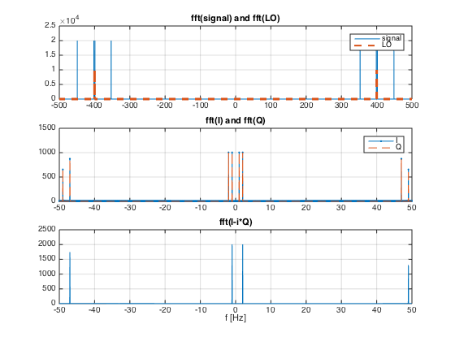

Quadrature signal sampling example codes
---

Why should we care about quadrature signals?

Richard Lyons explains this carefully in his very interesting piece on ["Quadrature Signals: Complex but not complicated"](https://www.ieee.li/pdf/essay/quadrature_signals.pdf).

Quadrature signals have a very interesting application in signal processing. 
By using both the in-phase and quadrature components of a sampled signal it is possible to actually double the acquired bandwidth from the [Nyquist limit](https://en.wikipedia.org/wiki/Nyquist_frequency) `fs/2` to `fs`.

The matlab [example code](fft_quadrature.m) serves as an example for this.

The local oscillator is set at 400 Hz

```
flo= 400; % Frequency of the Local Oscillator
```

The signal has four frequency components `[-47, -1, +2, +49]` relative to the local oscillator frequency `flo`, meaning `[353, 399, 402, 449]` Hz.

```
f1=flo+2; % Frequency of the positive signal
f2=flo-1; % Frequency of the negative signal
f3 = flo+49;
f4 = flo-47;
```

The frequency spectrums of the signal and the local oscillator can be observed in top plot of the figure.


The signal is then mixed with each of the local oscillator's quadrature components.

```
I= sig.*LOi;% Real part (I)
Q= sig.*LOq;% Imaginary part (Q)
```

By mixing the signal with a non-quadrature reference, the response is obtained as all the sums and subtractions of all the components, meaning
`±[flo ± [-47, -1, +2, +49]]`resulting in 

`400 + [353, 399, 402, 449] = 753, 799 802, 849`

`400 - [353, 399, 402, 449] = 47, 1, -2, -49`

and the negatives

`-400 + [353, 399, 402, 449] = -47, -1, 2 49`

`-400 - [353, 399, 402, 449] = -753, -799 -802, -849`

By filtering we extract only the low frequency components, in the middle plot of the figure.
We show here the spectrum result of the separate in-phase `I` and quadrature `Q` components. 
Since there is only a phase difference between `LOi` and `LOq` the mixer results overlap exactly. 
The negative frequency components are symmetric to the positive ones and we can not distinguish if the original signal was `[-47, -1, +2, +49]` or `[+47, +1, -2, -49]`, or any combination, relative to `flo`. 
The bandwidth is limited to `fs/2`.

However, if we now reconstruct the complex signal `I-iQ` in the digital domain, and calculate the resulting fourier transform we obtain the spectrum in the last plot of the figure. 
Here we clearly see each of the positive and negative frequency components of the original signal, relative to the `flo`.
Signal bandwidth is doubled as we can now distinguish positive and negative sidebands.




Useful applications include doppler radar, where we can distinguish direction of movement, and communications, doubling the useful bandwidth in the same medium.

